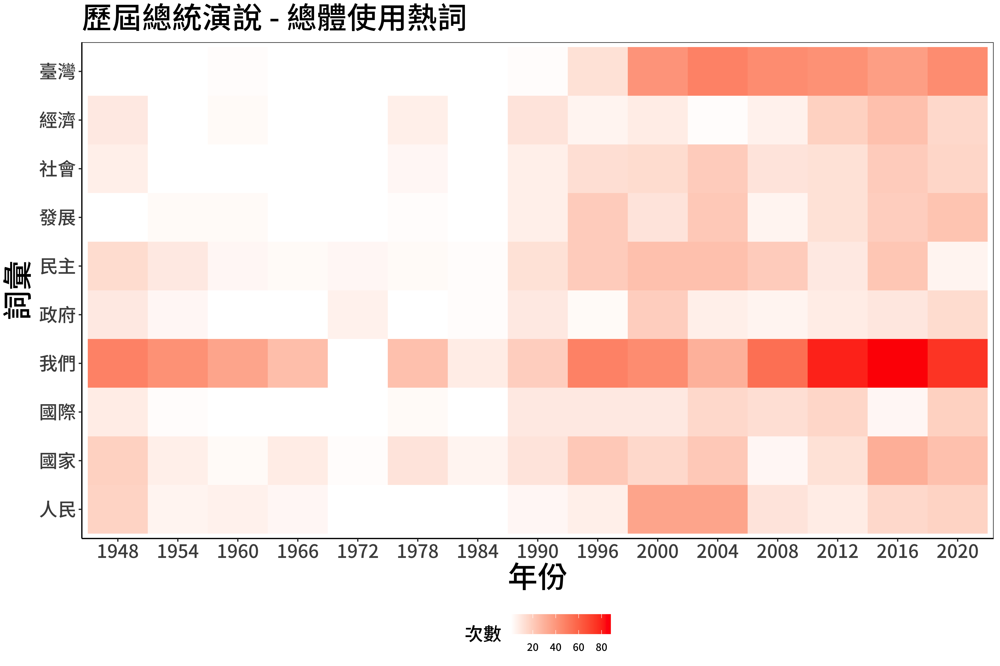

```{r setup, include=FALSE}
knitr::opts_chunk$set(echo = TRUE, results = 'hold', comment = '#>', error = TRUE)
```

## 作業目的: Data Visualization (02) Text

這份作業希望能夠讓你熟悉中文文字處理，並執行基本的文字相關分析，再將結果以圖表呈現。過程中會運用到過去幾週影片中的 document-level, word-level text analysis, regular expression, and text mining.

這次的作業使用維基文庫提供的歷任中華民國總統就職演說。因為總統就職演說本身代表了每一屆總統任期的，以其重要性，因此國內外媒體時常使用演說的內文當作素材，利用文字探勘的技巧寫出報導，以 2020 年為例，大家可以參考中央社的[蔡總統關心什麼 文字會說話
](https://www.cna.com.tw/project/20200520-inauguraladdress/) 以及 readr 的 [少了「年輕人」多了「防疫」：臺灣歷屆民選總統就職演說字詞分析
](https://www.readr.tw/post/2433)。國外的則可以參考 [“I Have The Best Words.” Here's How Trump’s First SOTU Compares To All The Others.](https://www.buzzfeednews.com/article/peteraldhous/trump-state-of-the-union-words#.tbr8QJvA7) by BuzzFeed, [Word Aanalysis of 2016 Presidential debates - Clinton vs. Trump](http://mkweb.bcgsc.ca/debates2016/) by Martin Krzywinski, and [Trump used words like 'invasion' and 'killer' to discuss immigrants at rallies 500 times: USA TODAY analysis](https://www.usatoday.com/story/news/politics/elections/2019/08/08/trump-immigrants-rhetoric-criticized-el-paso-dayton-shootings/1936742001/) by USA today.

小小的反思：直接用[資料](https://zh.wikisource.org/wiki/%E4%B8%AD%E8%8F%AF%E6%B0%91%E5%9C%8B%E7%AC%AC%E5%8D%81%E5%9B%9B%E4%BB%BB%E7%B8%BD%E7%B5%B1%E5%B0%B1%E8%81%B7%E6%BC%94%E8%AA%AA)、直接用斷詞結果(台灣 vs. 臺灣)可能會出錯喔！

## 作業: Data Visualization (02) Text

```{r message=FALSE, warning=FALSE}
### 這邊不要動
library(tidyverse)
library(jiebaR)
library(tidytext)

df_speech <- read_csv("data/AS06/df_speech.csv")
### 給你看資料長這樣
df_speech %>% glimpse()
```

### 0. 斷詞:

請利用 `library(jiebaR)` 斷詞，過程中也要保留詞性的欄位。

```{r message=FALSE, warning=FALSE}
### your code

```

### 1. 整體熱門詞彙:

請先找出所有總統演說當中出現次數最高的 10 個詞彙，接著計算每屆總統演說時，這些詞彙出現的次數，最後將結果畫成圖表。因為斷詞結果會因為預先載入的詞典有所不同，所以底下的示意圖參考即可，請盡量呈現 **有意義的** 詞彙！

```{r message=FALSE, warning=FALSE}
### your code

### your result should be
# 自己畫就好唷

```

```{r, echo=FALSE}

```

### 2. 各自熱門詞彙:

請先找出各個總統演說中，出現次數最高的 10 個詞彙，並且將結果畫成圖表。因為斷詞結果會因為預先載入的詞典有所不同，所以底下的示意圖參考即可，請盡量呈現 **有意義的** 詞彙！

```{r message=FALSE, warning=FALSE}
### your code

### your result should be
# 自己畫就好唷

```


```{r, echo=FALSE}
knitr::include_graphics('data/AS06/plot02.png')
```

### 3. TF-IDF:

請先篩掉各個總統演說中出現次數小於 5 的詞彙，接著計算 TF-IDF (不知道這是什麼的話請看老師影片！)，最後將結果畫成圖表。因為斷詞結果會因為預先載入的詞典有所不同，所以底下的示意圖參考即可，請盡量呈現 **有意義的** 詞彙！

```{r message=FALSE, warning=FALSE}
### your code

### your result should be
# 自己畫就好唷

```


```{r, echo=FALSE}
knitr::include_graphics('data/AS06/plot03.png')
```

### 4. 捉對廝殺:

請先留下蔡英文和馬英九的用詞，接著計算兩者用詞數量差異最大各自前十名的詞彙，最後將結果畫成圖表。因為斷詞結果會因為預先載入的詞典有所不同，所以底下的示意圖參考即可，請盡量呈現 **有意義的** 詞彙！

```{r message=F, warning=F}
### your code

### your result should be
# 自己畫就好唷

```

```{r, echo=FALSE}
knitr::include_graphics('data/AS06/plot04.png')
```
