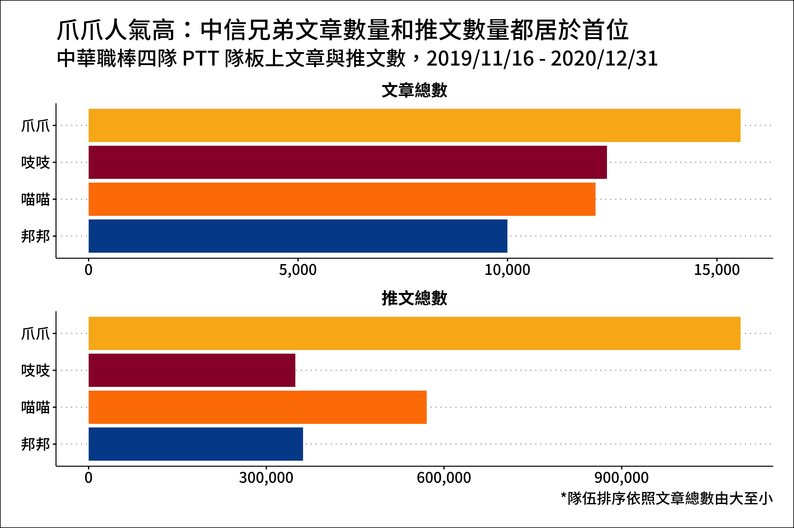

```{r setup, include=FALSE}
knitr::opts_chunk$set(echo = TRUE, results = 'hold', comment = '#>', error = TRUE)
```

## 作業目的: Data Visualization Layers

這份作業希望你可以利用視覺化的文法(grammar of graphics) 呈現結果。

這次的作業使用我自己抓的 PTT 棒球版資料，有興趣的話可以點進完整的文章 [誰是中職人氣王？哪隊球迷愛出征？PTT資料全解析](https://medium.com/dd-story-hub/%E4%B8%AD%E8%8F%AF%E8%81%B7%E6%A3%92-ptt%E6%95%B8%E6%93%9A-13778b43234a) 。

因為重點是練習畫圖，所以我都先畫好基本的圖，請你改成範例的樣子。

## 作業: Data Manipulation and Joining

```{r message=FALSE, warning=FALSE}
### 這邊不要動
library(tidyverse)
library(lubridate)
library(ggrepel)

df_hot_agg <- read_rds("data/Lab07/df_hot_agg.rds")
# df_hot_agg <- rea_csv("data/Lab07/df_hot_agg.csv")
df_main_type_n_big <- read_rds("data/Lab07/df_main_type_n_big.rds")
# df_main_type_n_big <- read_csv("data/Lab07/df_main_type_n_big.csv")
df_main_date_agg_four <- read_rds("data/Lab07/df_main_date_agg_four.rds")
# df_main_date_agg_four <- read_csv("data/Lab07/df_main_date_agg_four.csv")
df_push_agg_join_agg <- read_rds("data/Lab07/df_push_agg_join_agg.rds")
# df_push_agg_join_agg <- read_csv("data/Lab07/df_push_agg_join_agg.csv")

value_team_pair = c("Elephants"="中信兄弟","Guardians"="富邦悍將","Lions"="統一獅","Monkeys"="樂天桃猿","Dragons"="味全龍")
value_team_color_english = c("Elephants"="#FAB419","Guardians"="#004D9A","Monkeys"="#990036","Lions"="#FF8000","Dragons"="#D71010")
value_team_pair_short = c("Elephants"="爪爪","Guardians"="邦邦","Lions"="喵喵","Monkeys"="吱吱")

```

### 1. facet + coord

```{r message=FALSE, warning=FALSE}
### raw
df_hot_agg %>%
  ggplot(aes(x = board, y = value)) +
  geom_col() +
  facet_wrap(type ~ .)

### 熱門度統計: 文章數、推文數

# plot_popularity_article %>% 
  # ggsave(filename = str_c("photo/","plot_popularity_article_test", ".png"), dpi = 600, height = 8, width = 12)

```

### 2. alpha + position

```{r message=FALSE, warning=FALSE}
### raw
df_main_type_n_big %>%
  ggplot(aes(x = board, y = per, alpha = type)) +
  geom_col()

### 各板的發文類型有差嗎
knitr::include_graphics('data/Lab07/plot_type.png')

```

### 3. facet + scale_x_date

```{r message=FALSE, warning=FALSE}
### raw
df_main_date_agg_four %>%
  ggplot(aes(x = date, y = n_article)) +
  geom_line() +
  facet_wrap(board ~ .)

### 發生大事件
knitr::include_graphics('data/Lab07/plot_date_all.png')
```

### 4. fct_reorder + facet

```{r message=FALSE, warning=FALSE}
### raw
df_push_agg_join_agg %>%
  ggplot(aes(x = name, y = n)) +
  geom_col() +
  facet_wrap(board ~ ., scales = "free") +
  coord_flip()

### 都在討論誰
knitr::include_graphics('data/Lab07/plot_player_self.png')
```